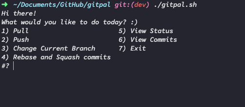
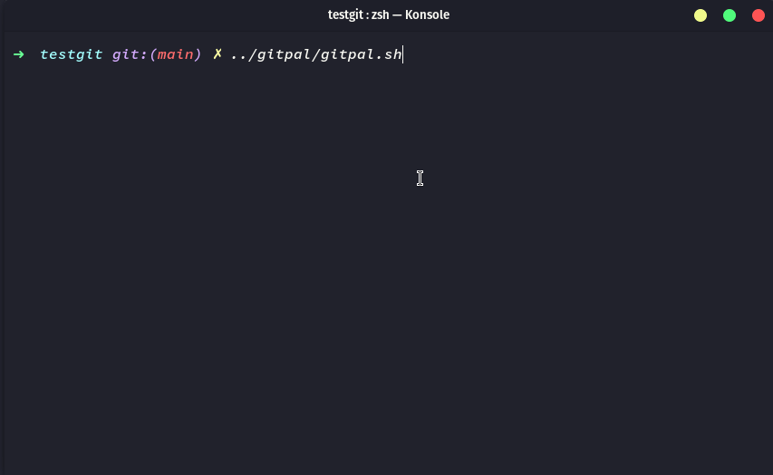

# GitPal

## Explanation

Not long ago, a friend was involved in a group project. Their group mates were challenging, to say the least. One day, they recounted to me how they had to fix a number of issues that had arisen when one of the group mates overwrote main while 5-6 commits behind. Needless to say I was confused. The few times I'd forgotten to pull, git had always yelled at me to pull and fix it first. That was when they let me know their group mates refused to use git, and instead dragged and dropped to the github desktop client. Horrified, I decided to write a cli to guide people through git in a way that is potentially less catastrophic. And so, gitpal was born.

## Demo

## Installation

For now, just run the script. Can add an alias for it if you want. 

## Features

- Easy to use guided process
- Friendly language throughout
- Uses git commands at its core, so all those features (including not allowing you to push to if you're behind main)
- Requires confirmation to push to main
- Ability to unstage all files/undo commit at any point before push if you need to make a last minute change
- Commit message confirmation to avoid typos
- Branch switching in cli
- Create new branch in cli
- Check file status, commit logs
- Rebase and squash commits interactively
